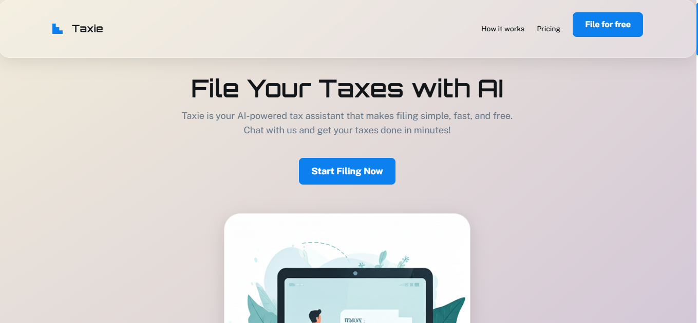
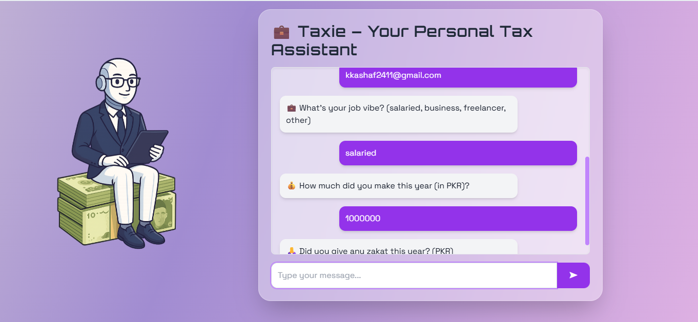

# Tax Filing AI Chatbot

Welcome to the **Tax Filing AI Chatbot** – a cutting-edge, AI-powered assistant designed to simplify the complexities of tax filing! This project is the result of passion, countless hours of dedication, and an unwavering commitment to creating an intuitive, user-friendly experience that demystifies tax procedures for everyone.

---

## Table of Contents
- [Overview](#overview)
- [Features](#features)
- [Screenshots](#screenshots)
- [Installation](#installation)
- [Configuration](#configuration)
- [Usage](#usage)
- [Project Structure](#project-structure)
- [Requirements](#requirements)
- [Contributing](#contributing)
- [License](#license)
- [Contact](#contact)

---

## Overview
The **Tax Filing AI Chatbot** harnesses the power of artificial intelligence and modern web technologies to deliver real-time tax filing assistance. Whether you're a seasoned professional or filing taxes for the first time, our chatbot provides clear, concise support—ensuring you never feel overwhelmed. Seamlessly integrating with the gmini API (v1.5) and leveraging robust backend services, this project makes tax season smoother and stress-free.

---

## Features
- **Intuitive Chat Interface:** Engage in interactive conversations for instant tax-related guidance.
- **Stunning Landing Page:** Get an immediate overview of the chatbot's purpose and capabilities.
- **Powerful AI Integration:** Leverage AI to answer your questions and provide step-by-step instructions.
- **API Powered Data:** Real-time data integration with the gmini API (version 1.5) for accurate tax information.
- **Seamless Email Notifications:** Utilizes Python’s built-in email libraries to deliver notifications effortlessly.
- **Responsive Design:** Enjoy an optimal experience across all devices, from desktops to mobiles.

---

## Screenshots
Visualize the experience:

- **Landing Page:**

  
  
- **Chat Screen:**

  

*Note: Screenshots are stored in `C:\Tax Filing AI Chatbot\static\screenshots` on your local machine. Adjust paths as necessary for your deployment.*

---

## Installation
Follow these simple steps to set up your Tax Filing AI Chatbot:

1. **Clone the Repository:**
   ```bash
   git clone https://github.com/kashafkhann---addd.git
   cd tax-filing-ai-chatbot
   ```

2. **Create a Virtual Environment:**
   ```bash
   python3 -m venv venv
   source venv/bin/activate     # On Windows: venv\Scripts\activate
   ```

3. **Install the Dependencies:**
   ```bash
   pip install -r requirements.txt
   ```

*Enjoy a clean setup and smooth installation process!*

---

## Configuration

**Before running the project, you must configure your environment variables for security and functionality:**
- **Gemini API**: Replace the placeholder Gemini API key with your own.
- **Gmail Email & App Password**: Set your Gmail address and app password for email notifications.
- **MySQL User & Password**: Update the MySQL username and password with your own database credentials.

You can set these variables in a `.env` file at the root of your project:

```plaintext
GEMINI_API_KEY=your_actual_gemini_api_key_here
GMAIL_USER=your_gmail_address@gmail.com
GMAIL_APP_PASSWORD=your_gmail_app_password_here
MYSQL_USER=your_mysql_username
MYSQL_PASSWORD=your_mysql_password
```

**Never share your actual API keys, email passwords, or database credentials publicly. Keep your `.env` file secure and do not commit it to version control.**

---

## Usage
Launch your application with the following command:
```bash
python app.py
```
Then, open your browser and visit [http://localhost:5000](http://localhost:5000) to interact with the chatbot.

For production deployment, consider using Gunicorn:
```bash
gunicorn --bind 0.0.0.0:8000 app:app
```

---

## Project Structure
Our project is structured with clarity and simplicity in mind:
```
tax-filing-ai-chatbot/
├── app.py                  # Main Python application file (located at the root)
├── requirements.txt        # List of project dependencies
├── .gitignore              # Git ignore rules
├── static/                 # Contains all static assets
│   ├── index.html          # Landing page HTML file
│   ├── one.html            # Chat screen or additional slide HTML file
│   ├── css/                # CSS stylesheets
│   ├── js/                 # JavaScript files
│   └── screenshots/        # Screenshots (landing_page.png, chat_screen.png)
```

*Note: HTML files (`index.html` and `one.html`) reside directly in the static folder for simplicity, with Python code at the project root.*

---

## Requirements
This project utilizes the following Python packages:
```plaintext
Flask==2.2.5
python-dotenv==1.0.0
gunicorn==20.1.0
requests==2.28.2
gmini-api==1.5.0
```
All dependencies are precisely listed in the [requirements.txt](requirements.txt) file.

---

## Contributing
Contributions are at the heart of this project! If you have ideas, bug fixes, or enhancements:
- Open an issue to discuss your ideas.
- Fork the repository and create a pull request with your improvements.
- Follow our coding standards and include thorough documentation.

Every contribution enriches this project and helps users everywhere!

---

## License
This project is licensed under the [MIT License](LICENSE).

---

## Contact
For any inquiries, contributions, or questions:
- **Email:** kkashaf2411@gmail.com
- **GitHub:** [kashafkhann---addd](https://github.com/kashafkhann---addd)

---

Thank you for exploring the **Tax Filing AI Chatbot**! Your support and feedback are invaluable. Together, let's make tax filing a breeze!